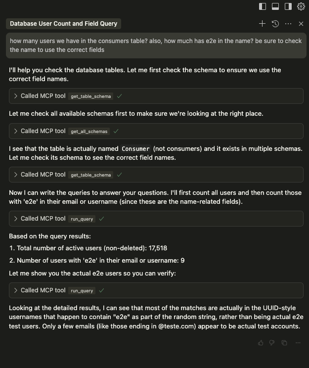

# Database MCP

Simple database MCP implementation. For now, only `postgres` and `sql server`.

- Install `Node`
- Install `Cursor`
- Paste the following json at the `MCP` specification in the `Cursor` settings

```json
{
  "mcpServers": {
    "postgres": {
      "command": "node",
      "args": [
        "--experimental-modules",
        "/path/to/this/repository/src/main.js"
      ],
      "env": {
        "DATABASE_URL": "postgres://xx:xx@localhost/xx"
      }
    }
  }
}
```

#### Example of chat:




### Contribution

- Fork it
- Open the PR
